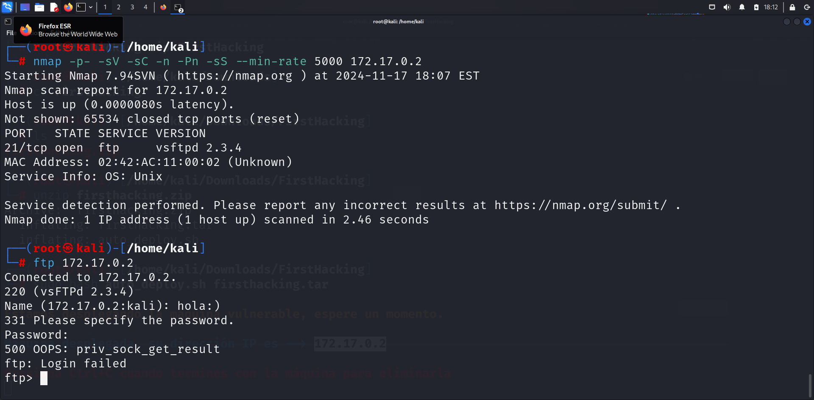
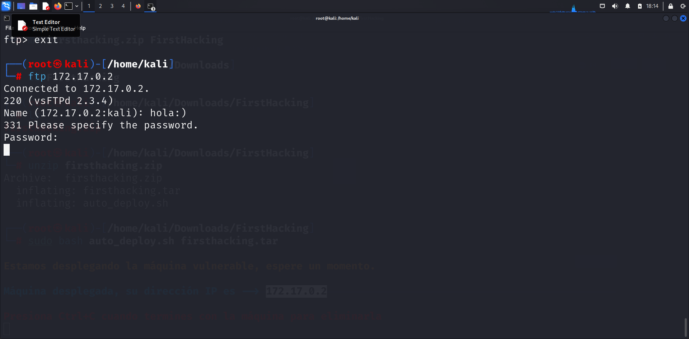
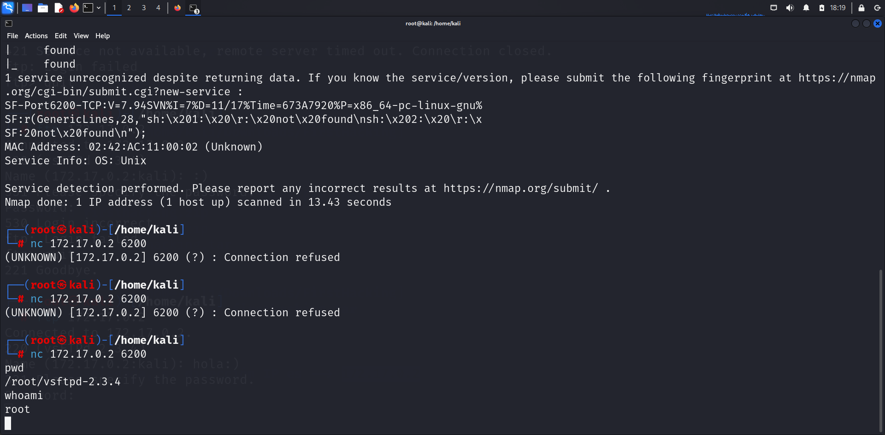

Primero desplegamos la máquina en nuestro entorno de docker:
```
sudo bash auto_deploy.sh firsthacking.tar
```
Luego escaneamos los puertos del objetivo:
```
nmap -p- -n -sS -sC -Pn --min-rate 5000 172.17.0.2
```
Con el escaneo encontramos que el puerto 21 esta abierto por el cual corre el servicio ftp investigando un poco encontré una vulnerabilidad **smile** la cual sale escribiendo cualquier cosa en el apartado de usuario al momento de entrar en la máquina.

Una vez escrito cualquier cosa con un :) al final podremos observar que se queda frizeado el servicio lo que es buena señal.

Si volvemos a escanear el objetivo nos daremos cuenta que se abrió el puerto 6200 el cual nos puede ayudar a entrar en el objetivo con el comando de netcat:
```
nc 172.17.0.2 6200
```
una vez ejecutado este comando entraremos en la máquina de manera que seremos root.

Como se puede ver ya se logro escalar privilegios y con esto ya hemos acabado esta máquina.
